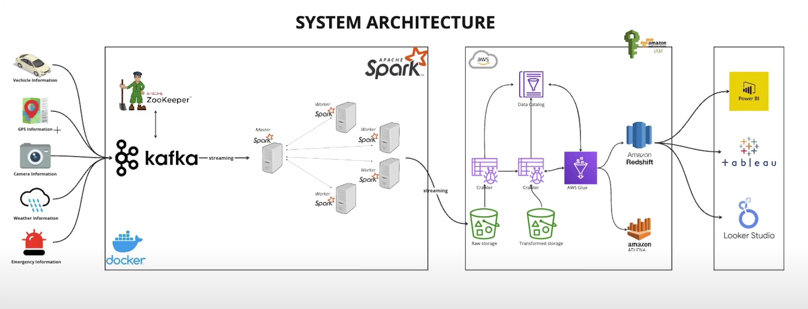

# Kafka-Spark-AWS-Pipeline

This project builds a real-time data processing pipeline using Kafka, Apache Spark, and AWS services. The system simulates real-time streaming data from various sources (GPS, weather, vehicle, traffic, emergency data), processes the data using Spark, stores it in Amazon S3, and loads it into Amazon Redshift for analytical queries and dashboard visualization.

## System Architecture


## Components
 - **Data Generation**: A simulation generates GPS, weather, vehicle, traffic, and emergency data.
 - **Kafka Streaming**: Data is ingested into Kafka for real-time processing.
 - **Apache Spark Processing**: Spark processes raw data, applies transformations, and structures it.
 - **Amazon S3 Storage**: Processed data is continuously stored in Amazon S3.
 - **AWS Glue**: Glue Crawlers scan the S3 bucket and update the Glue Data Catalog.
 - **Amazon Athena**: Queries and transforms structured data.
 - **Amazon Redshift**: Data is loaded into Redshift for analytical processing.
 - **DBeaver & Power BI**: A Redshift connection is established for visualization in Power BI.

## Installation & Setup
### Prerequisites
 - **Docker Desktop**: Ensure Docker Desktop is installed and running on your system.
 - **Python**: Run the `requirements.txt` file from the repository to install the necessary dependencies:
  ```bash
  pip install -r requirements.txt
  ```
 - AWS Account (S3, Glue, Redshift, IAM roles, Athena)
 - Power BI / Tableau / Looker Studio

### Steps
1. **Start Kafka & Zookeeper**
```bash
docker-compose up -d
```
2. **Run Data Simulation**
```commandline
python data_simulator.py
```
3. **Start Spark Streaming Job**
```commandline
docker exec -it smartcity-spark-master-1 spark-submit --master spark://spark-master:7077 --packages org.apache.spark:spark-sql-kafka-0-10_2.12:3.5.4,org.apache.hadoop:hadoop-aws:3.3.1,com.amazonaws:aws-java-sdk:1.11.469 jobs/spark-city.py
```
4. **Create S3 bucket**
5. Configure **AWS Glue Crawler** to detect new data.
6. Use **Athena** to query structured data.
7. Load Data into **Redshift**.
8. Create Dashboards in Power BI, Tableau, or Looker Studio.